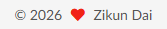

### 日常写作流程 (User Workflow)

配置完成后，以后你写博客只需要做这几步：

1. **新建文章**： 在终端输入：

	```bash
	hexo new "keyboard"
	```

	系统会在 `source/_posts/` 下生成 `我的第一篇博客.md` 和一个文件夹 `我的第一篇博客/`。

2. **编辑内容**： 用 Typora 打开那个 `.md` 文件。 截图粘贴进去（图片会自动保存到同名文件夹里）。

3. **发布**： 在终端输入：`hexo g -d` *搞定！*

```
hexo clean && hexo g && hexo s
```

```bash
hexo clean && hexo g && hexo d

hexo clean   # 清除缓存
hexo g       # 生成静态页面 (Generate)
hexo d       # 部署到 GitHub (Deploy)
```


```
<script src="https://utteranc.es/client.js"
        repo="zikun-dai/blog"
        issue-term="pathname"
        theme="github-dark"
        crossorigin="anonymous"
        async>
</script>
```

当前存在的问题：

1. 章的详情页最底部没有评论框

2. 页面最下面的author前面有个爱心符号，应当如何改成其他符号或者直接删掉？

	

3. 首页的预览，难以分清不同帖子，能否改为更分明的？只需要显示标题和

	

4. 页面主题色默认改为深色，页面角落设置一个按钮用于切换深色/浅色

