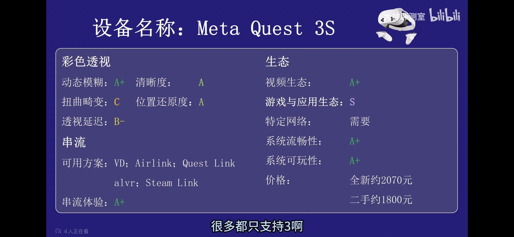
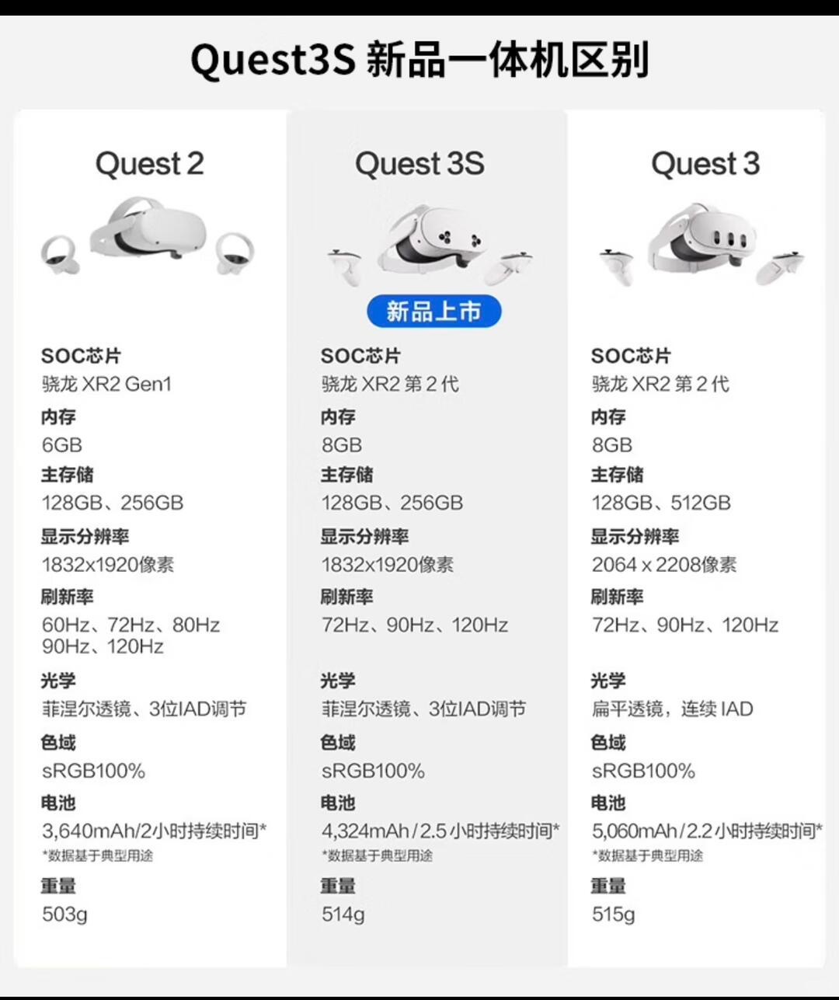
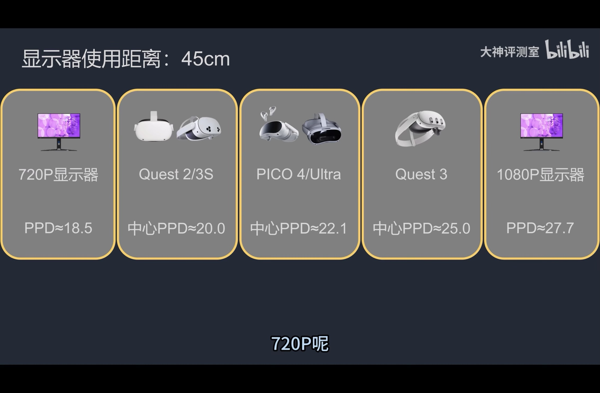

# 虚拟现实设备

## VR 头显

### 游戏推荐
- https://b23.tv/Awfm3LR
- Alyx
- 刺客信条
- 节奏光剑
- 光环

### 头显概览

综合来看：用 Q3S 在工位体验主流 VR 游戏、尝鲜空间计算、在家偶尔看电影即可，等家里换新主机或下一代头显再升级。

#### 镜片选择
- 玩游戏可以用菲涅耳。
- 做空间计算更适合 pancake 镜片。

### 参数对比
| 项目 | Quest 3 | Quest 3S | Vision Pro |
| --- | --- | --- | --- |
| 透镜 | pancake | 菲涅耳 | pancake |
| 清晰度感受 | 更高 | 略低 | 更高 |
| 深度传感器 | 有 | 少一个 | 有 |
| 暗光表现 | 一般 | 红外照明器更好（https://b23.tv/B1NDKOV） | 更好 |

#### 结论速记
- Quest 3：视场角更大，边缘不模糊，清晰度略高。
- Quest 3S：边缘模糊，需要移动头部看清；支持 Steam VR。
- Vision Pro：空间计算能力强，空间显示更成熟。

## 智能眼镜

| 系列/型号 | 关键特性 | 备注 |
| --- | --- | --- |
| Xreal one pro | 6DoF 需外接摄像头 |  |
| Xreal 1s | 支持 3DoF 窗口悬停 |  |
| Viture luma ultra | 6DoF 摄像头集成 | 需搭配颈环实现空间固定与手势 |
| 雷鸟 v3 | AI 拍摄眼镜 |  |
| 雷鸟 air3 系列 | XR 眼镜/显示器 | DP 输入；软件 3DoF；户外需遮光罩或电致变色 |
| 雷鸟 x4 pro | 可叠加全彩显示 | 正面摄像头；屏幕随视线移动，无法空间固定 |

## 综合总结

### 购买分析与使用场景
- 只玩 VR 游戏/全景视频 → 选头显；预算敏感选 Q3S，重空间计算选 Q3。
- 主要虚拟屏幕/办公/看视频 → 选智能眼镜。
- 只想尝鲜 → 先上 Q3S。

- 清晰度约 720p~1080p（https://b23.tv/21W7A6W），不如日常 2K 显示器。
- 长时间佩戴不舒适，短视频更合适。
- 动态类游戏体验差距不明显。
- 先从便宜款入手，吃灰损失小（http://xhslink.com/o/92Vsc6um2xN）。

| 场景 | 更合适的设备 | 备注 |
| --- | --- | --- |
| 本机 VR 游戏 | 头显 | 内容贵，试玩后无法再玩盗版 |
| PCVR 串流 | 头显 | 主机在工位，Mac 可玩内容少 |
| 虚拟屏幕/看视频 | 智能眼镜 | 头显更重更热 |
| 旅途使用 | 智能眼镜 | 头显体积大 |
| 空间计算 | 头显（Q3 优先） | 仍以尝鲜为主 |
| 在家看电视/多窗口 | 头显或智能眼镜 | 主要尝鲜 |

### 基础概念

| 概念 | 典型特点 | 备注 |
| --- | --- | --- |
| XR | 可叠加真实背景 | 总称 |
| AR | 偏“加层”显示 | 轻量叠加 |
| MR | 多数时间是 2D 屏幕/办公 | 强交互 |
| 核心差异 | 传感器丰富度 | 决定体验上限 |

#### 代表设备传感器配置
| 设备 | 传感器配置 | 形态 |
| --- | --- | --- |
| Vision Pro | 眼动追踪 + 摄像头 + 空间传感器 + LiDAR | VR/MR |
| Quest | 摄像头 + 空间传感器 + 手柄 + LiDAR | VR/MR |
| Air3 | 摄像头 + 空间传感器 | AR/MR 眼镜 |
| X4 / V3 | 摄像头 | AR 眼镜 |

### 历史沿革
| 时间 | 事件 |
| --- | --- |
| 早期 | VR 一体机主要靠摄像头，专注 VR |
| 2023 WWDC | Vision Pro 发布，MR 进入大众视野 |
| 2023.09 | Quest 3 支持 MR，但仍在迭代 |
| 2025 | AR 眼镜涌现：从“显示器 + HUD”逐步到 3DoF/6DoF |
